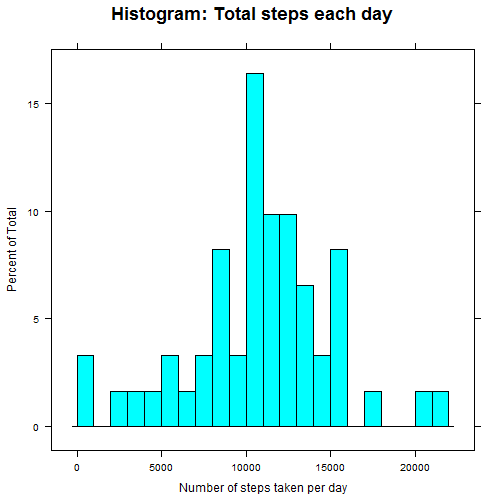
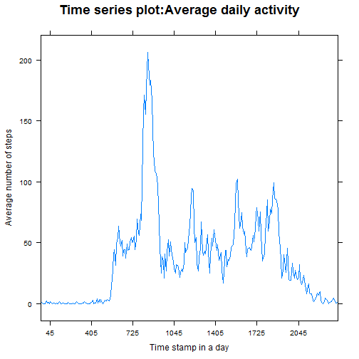
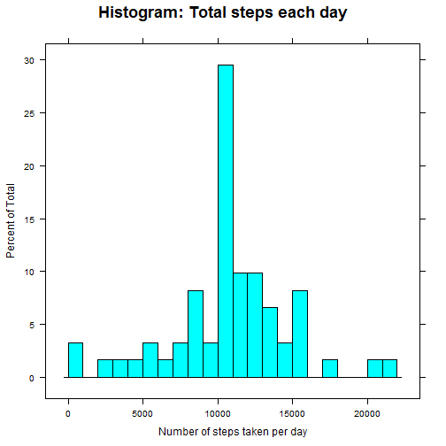
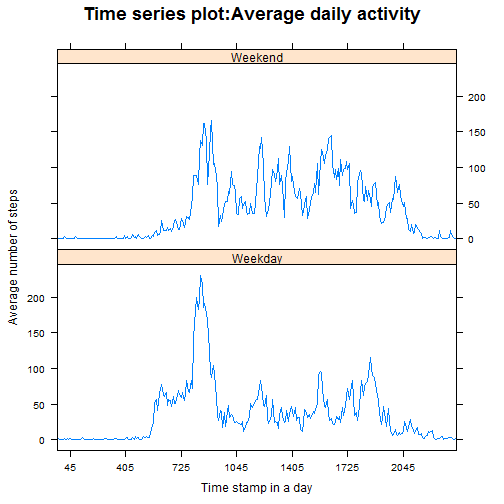

##Introduction

It is now possible to collect a large amount of data about personal movement using activity monitoring devices such as a Fitbit, Nike Fuelband, or Jawbone Up. These type of devices are part of the "quantified self" movement -- a group of enthusiasts who take measurements about themselves regularly to improve their health, to find patterns in their behavior, or because they are tech geeks. But these data remain under-utilized both because the raw data are hard to obtain and there is a lack of statistical methods and software for processing and interpreting the data.

This assignment makes use of data from a personal activity monitoring device. This device collects data at 5 minute intervals through out the day. The data consists of two months of data from an anonymous individual collected during the months of October and November, 2012 and include the number of steps taken in 5 minute intervals each day.

##Data

The data for this assignment can be downloaded from the course web site:

- Dataset: [Activity monitoring data][1] [52K]

[1]: https://d396qusza40orc.cloudfront.net/repdata%2Fdata%2Factivity.zip "Activity monitoring data"
The variables included in this dataset are:

- **steps**: Number of steps taking in a 5-minute interval (missing values are coded as NA)

- **date**: The date on which the measurement was taken in YYYY-MM-DD format

- **interval**: Identifier for the 5-minute interval in which measurement was taken

The dataset is stored in a comma-separated-value (CSV) file and there are a total of 17,568 observations in this dataset.

##Assignment

This assignment has been done in multiple parts. I have written a report that answers the questions detailed below. I have completed the entire assignment in a **single R markdown** document that can be processed by **knitr** and be transformed into an HTML file.

Throughout the report I have included the code that is used to generate the output presented using *echo = TRUE*. 

??For the plotting aspects of this assignment, feel free to use any plotting system in R (i.e., base, lattice, ggplot2)

I have Fork/cloned the [GitHub repository created for this assignment][2]. The completed files for this assignment have been pushed into the forked repository on GitHub. The assignment submission consists of the URL to the GitHub repository and the SHA-1 commit ID for the repository state.

[2]: http://github.com/rdpeng/RepData_PeerAssessment1 "GitHub repository created for this assignment"

NOTE: The GitHub repository also contains the dataset for the assignment so you do not have to download the data separately.

##Loading and preprocessing the data


```r
dat <- read.csv("./activity.csv", header = TRUE, sep = ",", colClasses = c("numeric", "factor", "numeric"))
```


##Mean total number of steps taken per day

For this part of the assignment, missing values in the dataset were ignored.

1. A histogram of the total number of steps taken each day


```r
library(lattice)
histogram(with(dat, tapply(dat$steps, dat$date, sum)), xlab = "Number of steps taken per day", main = list(label = "Histogram: Total steps each day", cex=1.5), breaks = 20)
```

 


2. Calculating and reporting the **mean** and **median** total number of steps taken per day


```r
meanval <- round(mean(with(dat, tapply(dat$steps, dat$date, sum)), na.rm = TRUE), digits = 6)
medianval <- round(median(with(dat, tapply(dat$steps, dat$date, sum)), na.rm = TRUE), digits = 6)
sprintf("Mean = %g", meanval)
```

```
## [1] "Mean = 10766.2"
```

```r
sprintf("Median = %01d", medianval)
```

```
## [1] "Median = 10765"
```


##Average daily activity pattern

1. Below is a time series plot (i.e. type = "l") of the 5-minute interval (x-axis) and the average number of steps taken, averaged across all days (y-axis)


```r
dat$interval <- factor(dat$interval)
avgsteps <- aggregate(steps ~ interval, dat, mean)
xyplot(steps ~ interval, avgsteps, type = 'l', ylab = "Average number of steps", xlab = "Time stamp in a day", main = list(label = "Time series plot:Average daily activity", cex=1.5), scales = list(x = list(at = seq(10,250,40))))
```

 


2. The 5-minute interval, on average across all the days in the dataset, that contains the maximum number of steps is:


```r
avgsteps$interval[(avgsteps$steps == max(avgsteps$steps))]
```

```
## [1] 835
## 288 Levels: 0 5 10 15 20 25 30 35 40 45 50 55 100 105 110 115 120 ... 2355
```


##Imputing missing values

Note that there are a number of days/intervals where there are missing values (coded as NA). The presence of missing days may introduce bias into some calculations or summaries of the data.

1. Calculating and reporting the total number of missing values in the dataset (i.e. the total number of rows with NAs)


```r
sprintf("Total number of missing values in the dataset = %g", sum(is.na(dat)))
```

```
## [1] "Total number of missing values in the dataset = 2304"
```


2. A strategy was devised for filling in all of the missing values in the dataset. The strategy uses the mean for that 5-minute interval across all days


```r
while (sum(is.na(dat)) != 0) { 
  dat[is.na(dat), 1] <- avgsteps[(avgsteps$interval == dat[is.na(dat), 3]), 2] 
  }
```


3. Created a new dataset that is equal to the original dataset but with the missing data filled in


```r
newdat <- dat
```


4a. A histogram of the total number of steps taken each day 


```r
library(lattice)
histogram(with(newdat, tapply(newdat$steps, newdat$date, sum)), xlab = "Number of steps taken per day", main = list(label = "Histogram: Total steps each day", cex=1.5), breaks = 20)
```

 


4b. Calculating and reporting the **mean** and **median** total number of steps taken per day


```r
meanval <- round(mean(with(newdat, tapply(newdat$steps, newdat$date, sum)), na.rm = TRUE), digits = 6)
medianval <- round(median(with(newdat, tapply(newdat$steps, newdat$date, sum)), na.rm = TRUE), digits = 6)
sprintf("Mean = %g", meanval)
```

```
## [1] "Mean = 10766.2"
```

```r
sprintf("Median = %01g", medianval)
```

```
## [1] "Median = 10766.2"
```


These values differ from the estimates from the first part of the assignment. Imputing missing data has *increased the frequency of '10-11k steps' band for a day.* Though the *mean remains the same*, *median is higher and now equal to the mean*.

##Differences in activity patterns between weekdays and weekends

Using the dataset with the filled-in missing values for this part.

1. Created a new factor variable in the dataset with two levels -- "weekday" and "weekend" indicating whether a given date is a weekday or weekend day.


```r
library(plyr)
newdat$weekdays <- weekdays(as.Date(newdat$date), abbreviate = TRUE)
newdat$weekdays <- factor(newdat$weekdays)
newdat$weekdays <- revalue(newdat$weekdays, c("Sat"="Weekend", "Sun"="Weekend", "Mon"="Weekday", "Tue"="Weekday", "Wed"="Weekday", "Thu"="Weekday", "Fri"="Weekday"))
```


2. A panel plot containing a time series plot (i.e. type = "l") of the 5-minute interval (x-axis) and the average number of steps taken, averaged across all weekday days or weekend days (y-axis)


```r
library(dplyr)
```

```
## 
## Attaching package: 'dplyr'
## 
## The following objects are masked from 'package:plyr':
## 
##     arrange, count, desc, failwith, id, mutate, rename, summarise,
##     summarize
## 
## The following object is masked from 'package:stats':
## 
##     filter
## 
## The following objects are masked from 'package:base':
## 
##     intersect, setdiff, setequal, union
```

```r
seldat <- select(newdat, -date)
gdat <- group_by(seldat, weekdays, interval)
tdat <- gdat %>% summarise_each(funs(mean))
xyplot(steps ~ interval | weekdays, tdat, type = 'l', ylab = "Average number of steps", xlab = "Time stamp in a day", main = list(label = "Time series plot:Average daily activity", cex=1.5), scales = list(x = list(at = seq(10,250,40))), layout = c(1,2))
```

 
